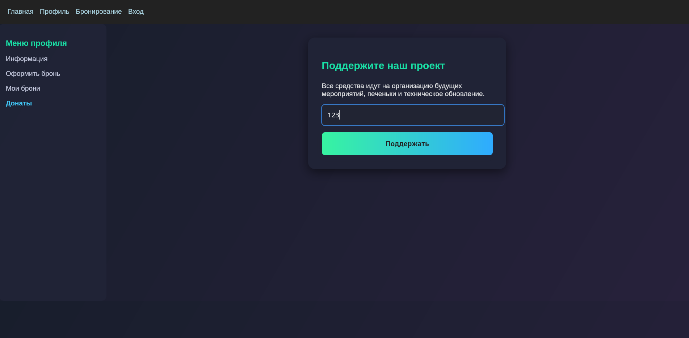
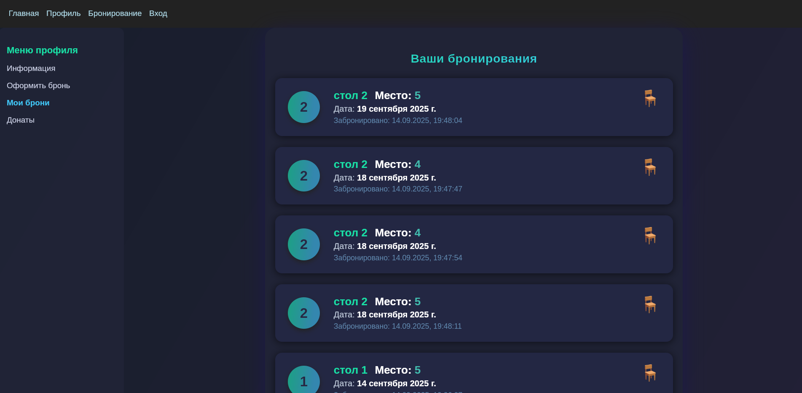
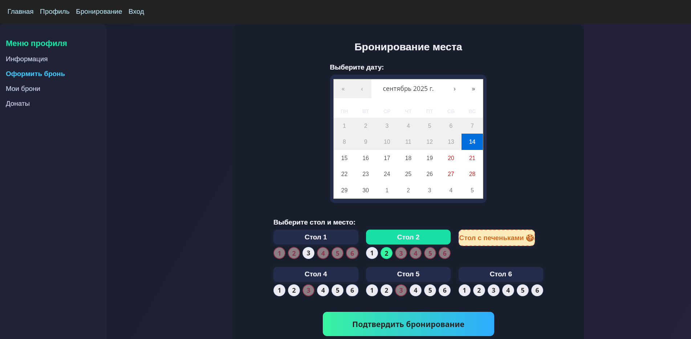
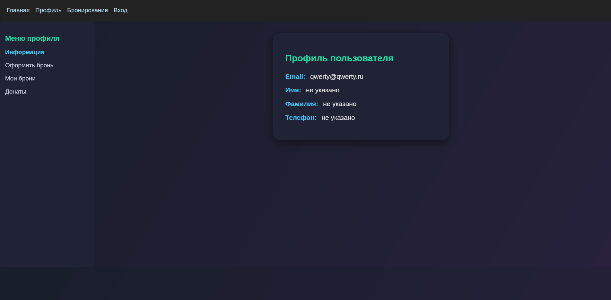

# Веб-приложение для бронирования мест в коворкинге 

## О проекте

Веб-приложение для бронирования мест в коворкинге, созданное в рамках Хакатона от Сбербанка. Функционал включает регистрацию, авторизацию, профиль пользователя, визуализацию и оформление бронирований, а также поддержку организации коворкинга через донаты.

---

## Используемые технологии

- **Backend:**
  - Go (Golang, web-framework `gin`)
  - JWT (авторизация пользователей)
  - REST API
- **Frontend:**
  - React (React.js)
  - React Router (Маршрутизация)
  - Styled Components / CSS Modules (стилизация, при необходимости)
  - Fetch API (взаимодействие с backend)  
- **База данных:**
  - PostgreSQL (система хранения аккаунтов и броней)
- **Инфраструктура:**
  - serve (раздача статических файлов)
- **Dev-tools:**
  - VS Code
  - Git, GitHub

---

## Ссылки и запуск

### Локальный запуск frontend
```
cd front
npm install
npm run start
```

### Сборка и запуск backend
```
export JWT_SECRET=0/D8/Igd7mO0Sj4IgBZ4wo7GT0WLKT/+RJqoMMN8/Kc=
cd back
go build -o backend ./main.go
./backend
```
---

## Основной функционал

- **Регистрация и логин:**  
  Безопасная регистрация, JWT-авторизация, хранение истории активных сессий.

- **Профиль пользователя:**  
  Просмотр информации, email, обновление данных.

- **Бронирование мест:**  
  Интерфейс выбора даты, стола, места. Автоматическая недоступность уже занятых мест.

- **Мои бронирования:**  
  Просмотр всех личных активных и прошедших броней (с датой, временем, номером стола и номером места).

- **Донаты/Поддержка:**  
  Возможность ввести сумму и поддержать организацию.

- **Уведомления об ошибках:**  
  Валидация форм, сообщения об ошибках (например, занятое место, некорректный логин).

---

## Cкриншоты интерфейса

### Меню профиля и окно доната



### Список броней пользователя



### Форма бронирования места



### Просмотр профиля



> Скриншоты иллюстрируют основные страницы пользовательского интерфейса: навигация, оформление доната, просмотр профиля, разделы активных и прошлых броней, календарь выбора дат и визуализация занятых/свободных мест.

---

## Контакты и поддержка

Для вопросов и предложений вы можете открыть issue или написать администратору проекта.

---

**PS:** Разработка велась на Arch Linux, основной стек — Go + React + PostgreSQL.  
Проект тестировался в последних версиях браузеров Chrome и Firefox.
